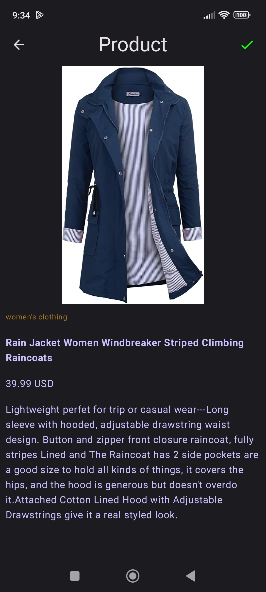

# GoodShop

GoodShop is a sample project that presents a modern approach to Android app development.

The project tries to combine popular Android tools and to demonstrate best development practices by utilizing up to date tech-stack like Compose, Kotlin Flow and Hilt using fakestoreapi.com and firebase.

The sample app layers its presentation through MVVM presentation pattern. Additionally, the application features animations like expanding and collapsing row items.

## Description

A Clean Architecture App to show use of  multi-module-architecture in a Jetpack Compose.

The modules are as follow:

* features: Presentation Layer

* domain: Business Logic Layer

* data: Data Access Layer

* utils: Extension And UI Layer

* home: A Screen Layer

* authentication: A Screen Layer

* catalog: A Screen Layer

* home: A Screen Layer

* order: A Screen Layer

* settings: A Screen Layer

* navigation: A Navigation Layer

## Images

## Tech Stack

* Multi-Module-Architecture
* OTP Authentication
* [Kotlin](https://kotlinlang.org/) 100% coverage
* [Jetpack](https://developer.android.com/jetpack)
  * [Compose](https://developer.android.com/jetpack/compose)
  * [Navigation](https://developer.android.com/topic/libraries/architecture/navigation/) for navigation between composables
  * [ViewModel](https://developer.android.com/topic/libraries/architecture/viewmodel) that stores, exposes and manages UI state
* [Material Design](https://m3.material.io/)
* [Hilt](https://developer.android.com/training/dependency-injection/hilt-android) for dependency injection
* [Coroutines](https://kotlinlang.org/docs/reference/coroutines-overview.html) and [Flow](https://developer.android.com/kotlin/flow) for async operations
* AndroidX
* [Retrofit](https://square.github.io/retrofit/) for networking
* [Coil](https://github.com/coil-kt/coil) for image loading
* Solid Principles

## Presentation patterns layers
* View - Composable screens that consume state, apply effects and delegate events upstream.
* ViewModel - [AAC ViewModel](https://developer.android.com/topic/libraries/architecture/viewmodel) that manages and set the state of the corresponding screen. Additionally, it intercepts UI events as callbacks and produces side-effects. The ViewModel is scoped to the lifetime of the corresponding screen composable in the backstack.
* Model - Data source classes that retrieve content. In a Clean architecture context, one could use UseCases or Interactors that tap into repositories or data sources directly.

## Did you find this repository helpful?

Don't forget give a star.

## Didn't you?

Then fork this repo, make it better and don't forget give a STAR.

## The basis was to take a freelance project (I'm not selected candidate)

